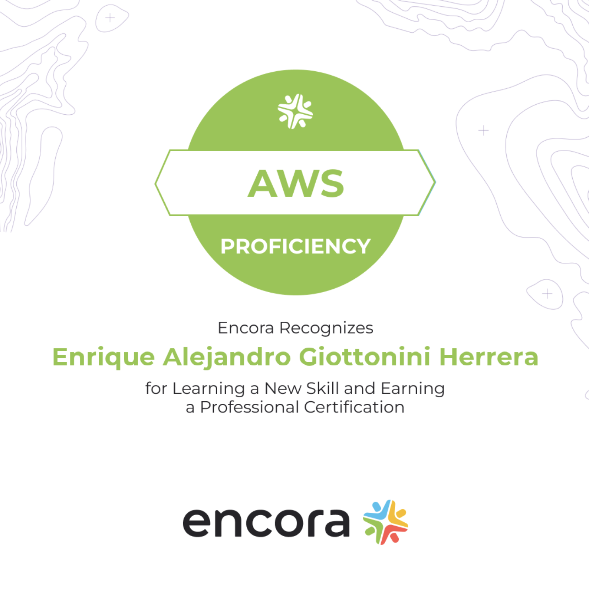

**tl;dr**: I passed.

    

It has been a long journey for me to get this certification, but the long hours of study finally paid off. As I received an email of the results just before the weekend, I could finally get some rest, and celebrate with some "filete de cabrería" ajúa... 🤠

Getting a cloud certification really opened my eye into how things are done at scale, and how at not-so-scale. Each of the problems presented (from the perspective that AWS could solve) shed ligth into many technologies that I have heard but never needed to understand such as Redis, Kafka, RabbitMQ, Jenkins, Docker, Kubernetes, OpenAPI, Terraform, etc.

For that reason not only did I learn how and when to use AWS, but also, when not to and what are the alternatives.

---

# **What was my approach?**

1. I took Stephane Mareek's Udemy course, which provided a comprehensive introduction to the AWS ecosystem.
2. I prepared and presented lighting talks on various AWS topics, which forced me to really try to understand the services so I could explain them clearly.
3. Writing weekly essays about what I learned helped me to review and reflect on the topics more slowly.
4. I drew inspiration from the experiences of others who had taken the certification exam, which reduced my nervousness and made me prioritize my focus on key services such as Lambda, DynamoDB, API Gateway, KMS, and CI/CD.
5. I took the official prep-exam from AWS to get a reality check and identify areas for improvement.
6. Hands-on labs were **key** in building my confidence, as I replicated scenarios presented in the prep-exam, and explored variations of each question. The AWS guides were particularly helpful (except for the Redis one).
7. I reviewed material and quizzes to understand the questions I got wrong.
8. Redesigned the architecture of past projects to imagine how I could incorporate certain AWS services.
9. I subscribed to two newsletters, Quastor and ByteByteGo, to learn from the experiences of big names in the industry and how they scale their products (most of them using the cloud).

In conclusion, achieving my cloud certification has been a long and challenging journey, but it has been incredibly rewarding. I have gained a deeper understanding of using the cloud and its many applications, as well as the confidence to apply my knowledge in real-world scenarios. I look forward to continuing my learning journey!

