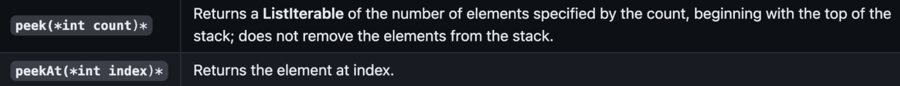
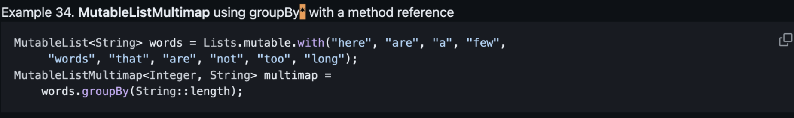
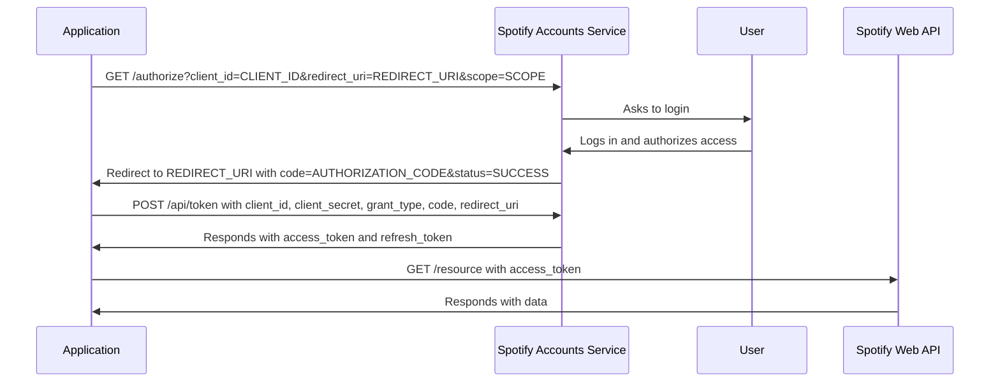

tl;dr: I got my first pull request accepted into an open-source project, Eclipse Collections, by fixing a simple typo in the reference guide. I also finished a first implementation of the Music Advisor project, a Java CLI application that uses the Spotify API to recommend music to the user.

# **Index**

1. [**Anatomy of a first Pull Request**](#anatomy-of-a-first-pull-request)
2. [**Authorization Code Flow**](#authorization-code-flow)
3. [**Music Advisor Project**](#music-advisor-project)

# <a id=anatomy-of-a-first-pull-request>**1. Anatomy of a first Pull Request** </a>

I was reading the reference guide in `eclipse-collections/docs/2-Collection_Containers.adoc` to get an understanding of the API and work on an issue. I found a low-hanging fruit, someone left a bold symbol markup typo:



I then ‘CTRL + F <<\*>>’ in hopes of finding more typos of the same class, and I did find another one!



To fix the issue, I followed the Contributing Guide:

1. I signed an agreement on the Eclipse Foundation website, they have an automated test to check if you have signed the agreement.
2. I forked the repository into my account.
3. I created a local clone of the fork repo from the command line:

```bash
git clone
cd eclipse-collections
```

4. I configured the upstream remote of the OG repo (for pulling updates):

```bash
git remote add upstream
```

5. Synced my fork with the upstream repo:

```bash
git fetch --all
git pull upstream master --rebase
```

6. I removed the unnecessary ‘_’ in the table and added a ‘_’ to the word ‘groupBy’ using vim.

```diff
- *peek(*int count*)*
+ *peek(int count)*
```

```diff
- *groupBy
+ *groupBy*
```

7. I committed the changes to fork; the signoff is the same account (using `gh auth login`) in which I signed the step one agreement.

```bash
git add .
git commit --message "Fix bold markup typos in reference guide" --signoff
```

8. Repeated step 5, with no merging conflicts (obviously and thankfully).

```bash
git push
```

9. Used the GitHub GUI for making a PR from my fork.

10. Waited for review.

I received an email when my contribution got accepted and then merged which was a great feeling! Now the process is more clear to me, and I can start working on more complex issues.

# <a id=authorization-code-flow> **2. Authorization Code Flow** </a>

This week I got to learn about the Authorization Code Flow, which is a way to authorize a user to access a resource. The idea is that an user needed to authenticate with an spotify account, so I won't have to store the user's credentials in my application. The flow goes like this:

1. I created my credentials on the Spotify Developer Dashboard, which gave me a `client_id` and a `client_secret` that the client application uses to identify itself to the **authorization server** (Spotify Accounts Service).
2. The client application redirects the user to the **authorization server** with the `client_id`, `redirect_uri`, and `scope` (permissions) as query parameters. In my case, I just printed the auth link to the console.
3. The user logs in to Spotify and grants the client application permission to access the requested data.
4. The **authorization server** redirects the user back to the client application with an authorization code.
5. The client application sends a POST request to the **authorization server** with the `client_id`, `client_secret`, `grant_type`, `code`, and `redirect_uri` as form parameters.
6. The **authorization server** responds with an access token and a refresh token.
7. The client application can now use the access token to make requests to the Spotify API.

The flow can be represented as a sequence diagram:



I implemented the `auth` command in the Music Advisor project, which starts an HTTP server that listens for incoming requests. When the user confirms or rejects the authorization, the server returns the following text to the browser:

- "Got the code. Return back to your program." if the query contains the authorization
- "Authorization code not found. Try again." otherwise.

After the code is received, the server shuts down and I get the `access_token` by making a POST request on `${authorization-server-path}/api/token`, with the `access_token` the program can now make requests to the Spotify API for getting for example "featured playlists", or "new releases".

This is not the first time I've worked with OAuth2, but it's the first time I've implemented the Authorization Code Flow, and it was a great learning experience to know how it works behind the scenes.

# <a id=music-advisor-project> **3. Music Advisor Project** </a>

I've been working on the Music Advisor project, a Java CLI application that uses the Spotify API to recommend music to the user. The project has the following functional requirements:

- Read two optional server points from command line arguments:
  - `-access`: provide an authorization server path, with a default value of https://accounts.spotify.com
  - `-resource`: should provide API server path, with a default value of https://api.spotify.com
- Read an optional configuration from command line arguments:
  - `-page`: to paginate results with a default value of five
- An `auth` command that will print the auth link and allow us to use other commands. Commands are unavailable if user access for the program is not successful.
- A `featured` command that displays a list of Spotify-featured playlists with their links fetched from API, and paginated
- A `new` command that displays a list of new albums with artists and links on Spotify; same reqs
- A `categories` command that displays a list of all available categories on Spotify; same reqs
- A `playlists C_NAME`, where C_NAME is the name of a category. The list contains playlists of this category and their links on Spotify; same reqs
- An `exit` command that shuts down the application; same reqs

For this project I learned and used the MVC architectural pattern. It was hard at first, but it made click when I started seeing the model as the "state" of my application. The bedrock of my implementation is the `/model/Session.java` class, which holds the state of the application as follows:

```java
package advisor.model;

import lombok.Getter;
import lombok.Setter;

@Getter
public class Session {
    private boolean isActive = true;
    private boolean isAuthenticated = false;
    @Setter private String authorizationCode;
    @Setter private String accessToken;
    @Setter private Pageable<Playlist> playlistCache;
    @Setter private Pageable<Album> albumCache;
    @Setter private Pageable<Category> categoriesCache;
    @Setter private String lastCommand;
    public void setValidAuthentication() {
        isAuthenticated = true;
    }
    public void endSession() {
        isActive = false;
    }
}
```

And the `/controller/SessionController.java` class, especially the `run` method, which is the entry point of the application:

```java
    public void run() {
        while (session.isActive() && inputScanner.hasNextLine()) {
            String commandQuery = inputScanner.nextLine();
            List<String> tokens = new ArrayList<>(List.of(commandQuery.split(" ")));
            if (tokens.isEmpty() || !VALID_COMMANDS.contains(tokens.get(0))) {
                view.displayUsage();
                continue;
            }

            String command = tokens.remove(0);
            if (command.equals("exit")) {
                view.exit();
                session.endSession();
            }

            if (!session.isAuthenticated() && !command.equals("auth")) {
                view.requestUserAuthorization();
                continue;
            }

            if (command.equals("auth") && !session.isAuthenticated())  {
                auth();
                continue;
            }

            if (command.equals("prev") || command.equals("next")) {
                changePage(command);
                continue;
            }
            fetchResults(command, tokens);
        }
    }
```

I liked how the MVC ended up, I can see how I could add a GUI to the application and the model would remain the same. I also liked how the `Session` class ended up, it's like a "state" of the application, and I can see how I could add more features to the application and the `Session` class would remain the same.

The most challenging part of the project was to implement pagination, because I didn't where to keep the flow state of the application. I ended up creating a `Pageable` class that holds the current page, the total pages, and the items of the page. I also had to implement a `prev` and `next` command to navigate through the pages, and a cache for each type of resource (playlists, albums, and categories).

I'm looking forward to refactoring the project using a command line framework like "picocli" or "Spring Shell/CLI", because I think it would make the code more readable and maintainable. Also I had troubles with implementing the my own server and client for the Authorization Code Flow, especially with managing Threads and waiting for the authorization code, I would like to explore something like "Spring Web" for that or "Micronaut" to follow best practices and avoid reinventing the wheel.

My main takeaways from this project is that **"over abstraction"** is something that Java lures you into, and is something to keep an eye on. I also learned that it turns out that the **business logic code is significantly smaller that the "plumbing" code** (like the HTTP server, the HTTP client, the pagination, the cache, etc), and that's why I think a framework would help me to focus on the business logic and not on the plumbing.
