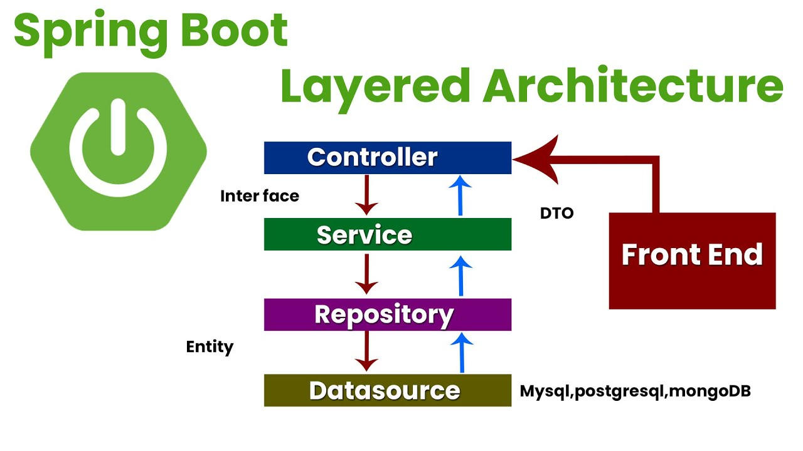

<!-- **Learning objectives:**

- Being able to explore and discover open-source projects to contribute to in your 1st and 2nd stacks.
- Getting familiar with new projects and diving into their large codebases.
- Setting up the project’s environments and interacting with them to get a better understanding of how they work.
- Practicing and learning more about the chosen programming languages and how to integrate them into the project's codebases.

 Weekly essay with the insights the spark got from these two weeks, the challenges they faced, what they learned to complete the PR’s.

What I also learnt from Spring REST Cinema project:

Spring Web Layer Architecture
DTO
Global Exception Handling and Custom Errors
Apache Kafka 101
-->

tl;dr: This week, I started searching to work on a technical issue in an open-source project. After many attempts, I'm yet to find a suitable issue to work on. However, I have learned a lot about getting a feel for the project and community around it, setting up the enviroment, tests, making changes, and submitting a PR. I will try with another approach, and work with smaller and newer projects to contribute. This week, I also worked on the Spring REST Cinema project, where I learned about Spring Web Layer Architecture, DTO, Global Exception Handling and Custom Errors, and as I was trying to contribute to Apache Kafka, I also learned a bit about how it works.

---

# **Index**

1. [**Finding a Needle in a Haystack**](#finding-a-needle-in-a-haystack)
2. [**Spring REST Cinema Project**](#spring-rest-cinema-project)
3. [**Apache Kafka 101**](#apache-kafka-101)

---

# **Finding a Needle in a Haystack** <a id=#finding-a-needle-in-a-haystack>

This week, I started searching for a technical issue in an open-source project to work on. I started by looking at the issues in the Apache Kafka [issue tracker](https://issues.apache.org/jira/projects/KAFKA/issues/KAFKA-17062?filter=allopenissues) and learnt that there are many people whose part of their job is contributing to OSS projects.
I first tried getting a feel of Kafka by downloading it with `brew`, and starting the `zookeper server`, the `kafka broker`, and the `kafka producer/consumer` communicating over one `partition` on a `topic`. After that I installed from the source code, run the tests, and built the binaries. I then tried to find an issue using searching in the issue tracker using filters such as "newbie" but they were to complex for me. As I have already spent a lot of time on this project without a clear path, I considered it to be more beneficial to work on the project that I already knew a bit about: Eclipse Collections.

One week ago I made a contribution on some typos in the documentation of this project, and I had already invested some time into trying to contribute into a fix for a bug. I decided to continue with this project, and I started reading the issues (non "good first issue") and planning for a solution. I use a `grep search` to find the classes that I need to change, and `go definition` to jump trough the code. I learnt about using the `file history` in the github gui to track the evolution of the file. After three issues that I tried to solve, I got a grasp into how they use some kind of "meta programming", or "code generation" for the tests and the implementation of the classes. The issues touched many parts of the codebase, abstract classes at the top of the hierarchy, and again, I felt that I was not ready to tackle them.

So I decided that since I have no experience with large codebases or specialized libraries, I should try to work with a web product, something that used a REST API, and that I could understand the business logic. I found some underveloped projects, but by this time I was already tired of searching for issues, and I decided to take a break and work on the Spring REST Cinema project.

I feel that trying to find a random issue in some random codebase just for the sake of contributing was like trying to find a needle in a haystack. I saw many "good first issues" filled with people asking to be assigned to them, but not commited to solve them. So it's obvious that there is a trend of people trying to contribute to OSS projects. Beign that the case, I think that I should try to work with smaller, newer projects, with business logic that I can understand, and that I might have a change to contribute to.

# **Spring REST Cinema Project** <a id=#spring-rest-cinema-project>

This week I worked on the Spring REST Cinema project. I learned about Spring Web Layer Architecture, which is composed of the `Controller`, `Service`, `Repository`, and `Model` layers. The `Controller` layer is responsible for handling the HTTP requests, and the `Service` layer is responsible for the business logic (like helper/aggregator functions). The `Repository` layer is responsible for the database operations (or any other data source), and the `Model` layer is responsible for the data structure. I also learnt in how to use Response Entities to return the status code and the body of the response, and how to use the DTO pattern to map the entities to the request and the response. Finally, I learned about the Global Exception Handling and Custom Errors, which is a way to handle the exceptions in a centralized way, and to return a custom error message to the client, using the `@ControllerAdvice` annotation, and the `@ExceptionHandler` annotation.

---

# **Apache Kafka 101** <a id=#apache-kafka-101>

I found a [gently introduction to Apache Kafka](https://www.gentlydownthe.stream/) illustrative book, which was very touching and used the illustrations as a mental model of the concepts. I also used the three first chapters of ["O’Reilly | Kafka: The Definitive Guide 2nd Edition"](https://www.confluent.io/resources/ebook/kafka-the-definitive-guide/?utm_medium=sem&utm_source=google&utm_campaign=ch.sem_br.nonbrand_tp.prs_tgt.dsa_mt.dsa_rgn.latam_lng.eng_dv.all_con.resources&utm_term=&creative=&device=c&placement=&gad_source=1&gclid=Cj0KCQjw-5y1BhC-ARIsAAM_oKkG39aDpJrE489aNeBdnKmJGy5v9KIrGVp7G9_sh-jKU80d-HYZewgaAsRUEALw_wcB) to understand the concepts of Kafka. I learned that Kafka is a "distributed event log", which is a way to communicate between different services in a distributed system. It is composed of `topics`, `partitions`, `offsets`, `brokers`, `producers`, and `consumers`. The `topic` is the category of the messages, the `partition` is the way to distribute the messages between the `brokers`, the `offset` is the position of the message in the `partition`, the `broker` is the server that stores the messages, the `producer` is the client that sends the messages, and the `consumer` is the client that reads the messages. As databases are designed to be efficient for storing and retrieveing data at rest, Kafka is designed to be efficient for storing and retrieving data in "motion".

