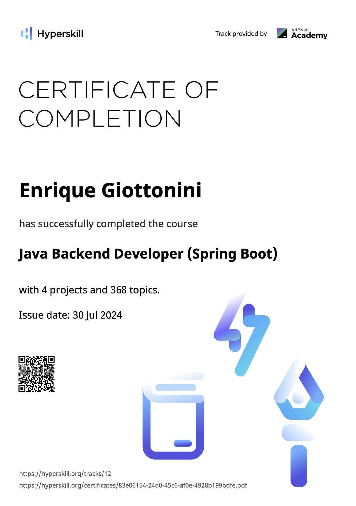

tl;dr: This week, I found a project that I could contribute to, a web client that manages Apache Kafka resources. Built with Spring Boot, Spring MVC, Spring Security, Spring Data JPA. I also finished a small project "Recipe Management System" for the course and finally got a certification as Java Backend Developer.

---

# **Index**

1. [**Contributing to Klaw**](#contributing-to-klaw)
2. [**A Java backend certification**](#a-java-backend-certification)

---

# <a id=contributing-to-klaw>**1. Contributing to Klaw** </a>

This week I found a project that I could contribute to, a web client that manages Apache Kafka resources. The project is called [Klaw](https://github.com/Aiven-Open/klaw). I decided to go this route as I was getting lost into the business logic of other projects, I found this project after [searching](https://stackoverflow.com/questions/54782469/are-there-any-big-spring-boot-open-source-projects) for web applications that used Spring and are Open Source.

While replicating a random issue, I found a bug in the application. The issue was that the application was throwing an error when the description of the topic was longer than 100 characters. I created an issue [here](https://github.com/Aiven-Open/klaw/issues/2543) to verify that it was something worth pursuing. It seemed fine by the maintainer and I started working on it.

# <a id=a-java-backend-certification>**2. A Java backend certification** </a>

I finished my Hyperskill certification in Java Backend Developer (Spring Boot). The course was very extense, and covered a broad amount of topics. I learned about the Spring Framework, Spring Boot, Spring MVC, Spring Security, Spring Data JPA, and how to build a REST API with Spring. I also got familiar with the Java language, and how to use it to build a backend application.

It's my intention for the following week to close the issue, learn a lot about how a enterprise grade application is structured, and contribute to it. I'm also planning to apply the best practices that I learned in the course to previous projects.

---
