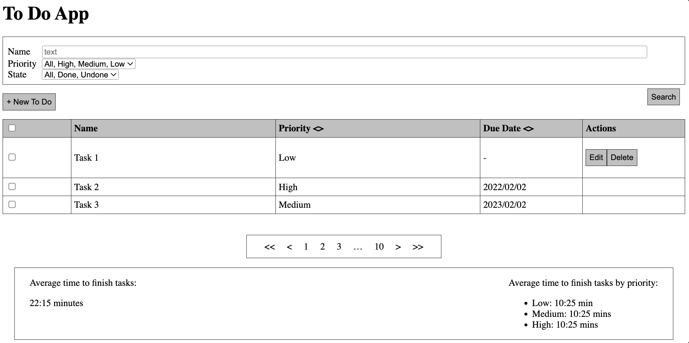
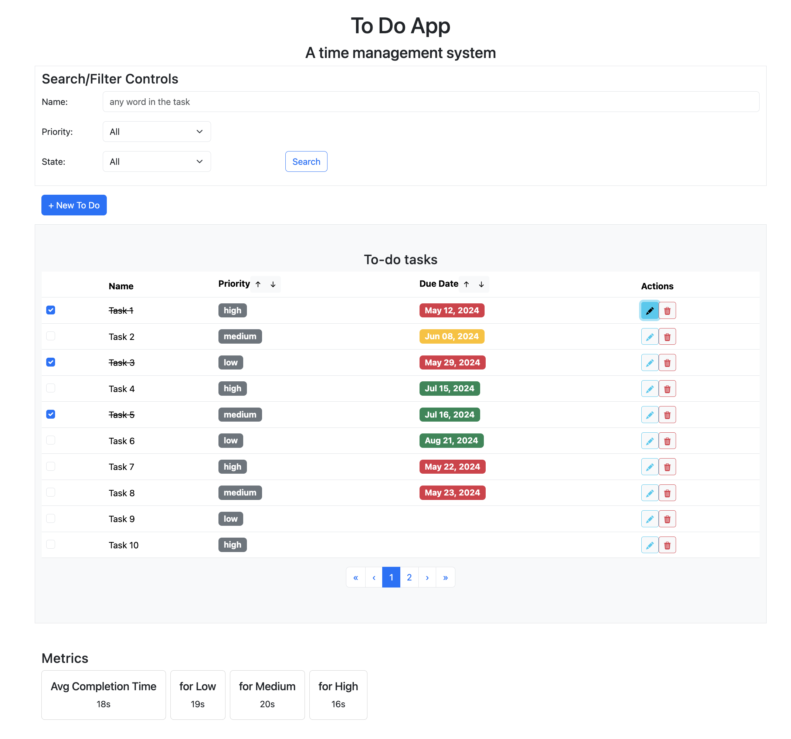

This week I continued to work on a Todo App, the project development was a bit rushed at the end, consequence of bad decisions, but it ended up being fully functional. It was a great experience, and I plan to continue developing more breakable toys in the future as the main takeaway of the this week is **_Practice beats theory when learning_**.

# Takeaways from the week

- TDD slows down the learning process
- Testing the frontend is harder than testing the backend
- To develop with springboot is to stand on the shoulders of giants
- Web design seems to be more complex than it should
- Practice beats theory when learning

# The Anatomy of a Todo App project approach

I was sure that the best approach to tackle this project was to start from the frontend, from what the eyes can actually see. In **_theory_** the backend would just provide API endpoints, and in **_theory_** the frontend will just consume them. I thought it could not be that difficult so I added another challenge to myself, TDD developing.

## A Failed Test Driven Development (TDD)

I learned about this methodology, and the concept of red/green/refactor. The idea is that you write tests first, planning the functionality ahead. When running the tests they will obviosuly come "red" as nothing has been actually implemented. Then you would to the minimum to pass those tests "green" (including cheating like hardcoded values, or methods that don't generalize). Lastly, you would refactor if tests and/or code could be further improved.

The idea of "cheating" to just pass tests come from the concept of **triangulation**. I learned that in order to narrow the scope of the tests to the business requirements its to write a failed test and write just enough code to make the test pass, then you write another test to break the "cheating" implementation, and force you to improve it, leading to a more generic solutions but limiting the scope to not think ahead of yourself.

I also learned about an interesting guideline to have in mind while refactoring in the book: [Test-Driven Development with React: Apply Test-Driven Development in Your Applications](https://www.oreilly.com/library/view/test-driven-development-with/9781484269725/?_gl=1*78ppoy*_ga*NDQxNjI3ODA1LjE3MTQxNTA5Mjc.*_ga_092EL089CH*MTcxNzAxMjQzMS4zLjEuMTcxNzAxMjUyNS4zNi4wLjA.)

### Refactoring techniques

1. **Rename variables:** to improve clarity and readability.
2. **Change function declarations:** to better represent its behavior and purpose.
3. **Rename parameters:** to better reflect its meaning and usage.
4. **Add more variables:** to store an intermediate value and improve readability and maintainability.
5. **Extract constants:** to store a frequently used value and improve code clarity.
6. **Add more parameters:** to increase flexibility and reusability.
7. **Extract functions:** Create a new function to encapsulate a set of related statements and improve modularity.
8. **Slide statements:** Rearrange the order of statements to improve clarity and readability.
9. **Move Fields:** Move a field from one class to another to better align responsibility and improve maintainability.
10. **Inline variable:** Remove a redundant or unnecessary variable and simplify the code. 11. Simplify logic: Simplify complex logical expressions to improve clarity and readability.

A better description of TDD and the pros/cons can be found in the following [blog](https://www.encora.com/insights/understanding-the-pros-cons-of-test-driven-development-tdd).

In **_theory_** you will end up with fully thought and tested code, in a slow but steady fashion. In practice...

### How testing first can slow you down

I invested quite some time into configuring the testing suite. I played with many similar options (Cypress, Playwright, Jest|Vitest + Puppeter), and the deciding factor was if I could actually run some tests in time, there was a lot of configs files that I didn't understand, more dependencies, and typescript/linting problems with vscode. At the end, I was pushed to use Vitest + Puppeter by my bundler (Vite...)

The most time consuming problem that I run into was that I knew what to test, but not how to test it. For example, one functional requirement was to add a new task by pressing a button and filling up a form in a modal. In **_theory_** I just needed to write that interactions with the HTML or DOM using the _data-testid_ tags. But the library/framework have verbose triggers like `expect(page.findByTestId("[data-testid=add-task-button])).not.toBeNull()` that increased massively the learning curve. I tried to mitigate this problem by getting insights with _copilot_, but many of the generated tests used deprecated methods, or tested trivial things, or produced green tests from the beginning. As I corrected tests to be actual tests I got a feeling of the tools, and could start writting them on my own, leading to better responses from _copilot_.

The constant refactors made the tests very difficult to mantain, as I was in principle doing total rewrites of the state management. I lacked clarity in how I was going to connect the frontend with the backend. I was worrying too much into not triggering "unnecesary actions" to the backend (like a POST request for checking a todo task as done and a GET request for the update), that I ended up thinking of a complicated state, and weighting more complexity to my frontend than to my backend.

In the other hand, when working with the backend, even though I had never used spring-boot (or Java for backend) I noticed a massive speed gain when not thinking in testing. I was implementing every API requirement, and "testing" the results calling the endpoint with _Postman_, giving me small victories instead of frustation fighting with the tests.

Once I implemented all the API requirements, I learned how to tests the endpoints (or the Java Controller/Service) using _JUnit_ and _Spring MockMvc_. Refactors were made to cover edgecases, and improve readability, but the refactors were an order of magnitude faster than with frontend.

One important point that I learned is that automated tests can also give you a false sense of security. Once I thought I was finished, I started manually testing the app with the frontend, and detected some edge cases that were not being handled in the backend.

## Developing the frontend

The approach I followed was recommended by one of my mentors. I implemented the whole application UI structure using HTML into a single component.



Instead of nesting 10 divs for a component, I learned by my mentors that I needed to use appropiate tags to describe semantically better the structure. It helps with SEO, web crawlers, and most importantly accesibility _(a11y)_.

After that I started separating into components the application into a structure similar to this:

```js
<App/>
    <Controls/>
        <ControlsForm/>
        <SearchButton/>
    <NewTaskButton/>
    <DataTable/>
        <Table/>
            <SortByPriority/>
            <SortByDueDate/>
            <TableRows/>
                <Checkbox/>
                <EditButton/>
                <DeleteButton/>
        <Pagination/>
    <Metrics/>
```

And then I started connecting to the API endpoints, using useState, useEffect hooks, etc. I could have done a way better job a managing the state, and structuring the frontend, but I have already lost too many time with a failed TDD that I prioritized a working app from the user standpoint that a quaility/easy to maintain tested app.

After many refactors connecting to the backend, I achieved a ugly but functional application. I tried using CSS but time was ticking, I ended up using something I used in the past: **Bootstrap**.

I didn't like working with `react-bootrap` but I have to admit that it made my application way better looking with not much effort. I think there is a lot of room of improvement here as I felt limited in what I could accomplish using CSS. I knew what I wanted it to look like but half of the time I gave up to what Bootstrap offered me.

This what someone without experience in web-design could accomplish in 4 hours just replacing HTML \<table\> with react-bootstrap \<Table\>:



Honorable mentions of concepts that I learned from my mentors are _Optimistic vs Pending UI_ and _Debouncing_. I didn't deal with them in this project, but now I can indentify them in the wild.

## Developing the backend

I learned to implement a crud API in Springboot by following the official documentation and stack overflow answers.

I learned about `maven` and configuring the project dependencies from the `pom.xml`. Its still magic what is doing in the background, as I only needed to run four commands `mvn {package, spring-boot:run, test, clean}`, but I didn't suffer from any complication (ejem ejem npm).

I also learned to structure my project into some kind javaesque monster:
`Model -> Repository -> Controller`.

1. The model/entity was the TodoTask structure.
2. I implemented a repository (of todo tasks) interface as a list (not efficient but good to not worry too much), and extended a class for a TodoRepositoryInMemory that had public methods to modify the internal list.
3. Finally, I used dependendy injection magic to "@Autowire" the TodoTaskRepo.. into "@Get/Post/PutMappings" endpoints from the Controller that listened to "localhost:9090/todos".

I didn't understand much of the injections, but it worked at first try so I ended up kinda liking the framework.

# Practice beats Theory and Final Remarks

> “Although understanding the theory behind the action enables one to speak, it is practice that enables one to act.”

I wrongly estimated that this project was going to take little time. I also wronly assumed that TDD was an extra thing that I could explore. The application is runnable, and usable, but not well tested (in the frontend). I think that I could have managed the state way cleaner in the frontend, and that I could be used a more efficient methods for the backend. But I guess that I'm not satisfied because I am still an apprentice, as in _softare craftmanship_.

The lesson I take from this module is to expose myself to more problems, and try to solve them from a practical standpoint. I have an idea of how things can be approached, but is not until you get your hands dirty that you start seeing the important details that can be overlooked.
