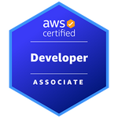
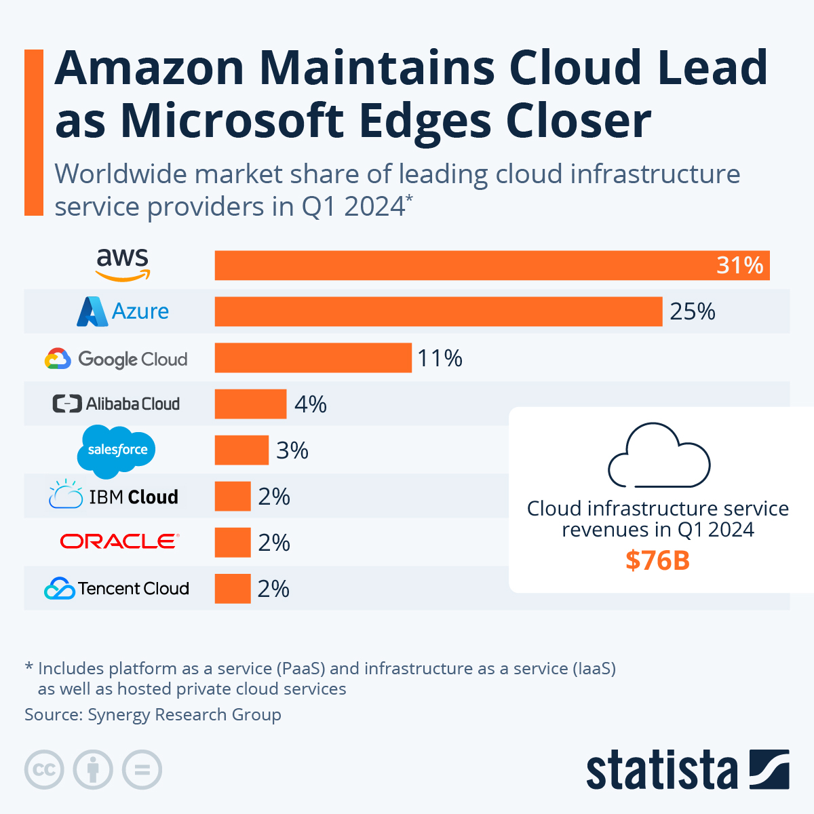
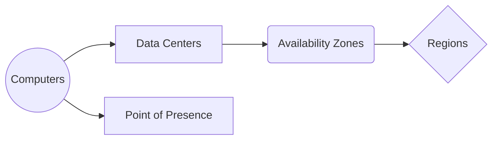
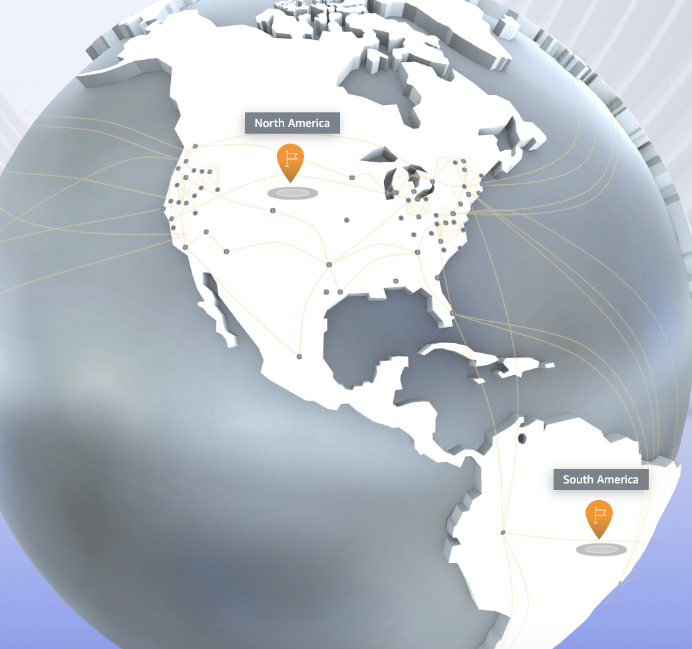

**tl;dr**: This past week, I began studying for the AWS (Amazon Web Services) [Associate Developer certification](https://aws.amazon.com/certification/certified-developer-associate/). This process has introduced me to a wide range of cloud computing concepts and services offered by Amazon.

The tech market is trending in GenAI, Data, and Cloud. Aligned with the direction of Encora, I have been provided with the opportunity to learn how to develop solutions using _Cloud_ services, and get certified in...


The [Associate DVA-C02 Exam](https://d1.awsstatic.com/training-and-certification/docs-dev-associate/AWS-Certified-Developer-Associate_Exam-Guide.pdf) prepares you with knowledge of the different services in the cloud. If there is a service there is a use-case, so in order to understand why some services exists, it's needed to explore concepts and challenges of systems that scale. The exam cover +30 AWS Cloud Services (of a total of 200), providing me with a lot of material to learn.

---

# Getting started with AWS

Basically AWS provides on-demand servers and applications. It is used because it let companies to not worry about infrastructure, and software developers to create applications that can scale easily.

## AWS History

- 2002: AWS was internally launched to handle the growth of Amazon
- 2003: Idea to market AWS infrastucture
- 2004: Launched publicly with SQS product
- 2006: Re-launched with SQS, S3, EC2
- 2007: Launched in Europe (now used by Netflix, Dropbox, Airbnb, ...)
- 2019: AWS produce 35B usd of annual revenue

I learned that AWS is the the current cloud leader with over 1M active users. However, now is getting competition from other big names as the following graphic shows:


## AWS Global Infrastructure

At its core, the cloud functions similarly to "another person's computer." AWS infrastructure can be conceptualized as follows:



Computers without monitors (servers) are being maintained and secured by IT teams in special warehouses known as Data Centers. Multiple interconnected and powered Data Centers constitute an Availability Zone (AZ), forming an isolated system. Lastly, geographically distinct collections of AZs create AWS Regions. Data can flow through Regions, AZs, Data Centers, and smaller Edge Locations caching centers (Points Of Presence).

I found a very cool [3D map](https://apps.kaonadn.net/5181491956940800/index.html) to visualize how data flows in AWS.



# Identity & Access Management (IAM)


The first service I learned is used to setup permissions of what, who, and how can an use other AWS services. The idea here is to setup a user for each person withing an organization and group them. Users and groups can be assigned with a set of permissions (renting a computer, accessing a network, etc) with a JSON document called "policy". The best approach is to give as little as possible permissions to an user, and modify them as needed.

Below is the basic structure of an IAM policy:

```json
{
  "Version": "2012-10-17", // Policy language version
  "Id": "Optional identifier",
  "Statement": [
    {
      "Sid": "Optional identifier for statements",
      "Effect": "Allow | Deny", // Or deny access
      "Principal": {
        // whom is the policy appplied to: account/user/role
        "AWS": ["arn:aws:iam::...:root"]
      },
      "Resource": ["arn:aws:s3:::mybucket/*"] // "<ARN of the affected resource>"
    }
  ]
}
```

To assign policies to an AWS service you define a Role, say a role for EC2 instances to call Lambdas on your behalf.

I learned that you can access to AWS services through the website (AWS Management Console), a CLI (terminal) using a access key, and a SDK (libraries).

# Elastic Cloud Computing (EC2)


One of the most popular service. Basically renting CPU, RAM, and Storage. Easy to scale up/down/in/out.

Key components of EC2:

- Renting VMs (EC2)
- Persistent Storage - Elastic Block Store (EBS)
- Load Distribution - Elastic Load Balancer (ELB)
- Automatic Scaling - Auto Scaling Groups (ASG)

I learned how to launch a virtual server (EC2), the different parameters available, instance types, security groups, and connecting through ssh.

## EC2 Instance Store

Is the storage that comes attached by default to a EC2 Instace. It can be for booting the EC2 Instance, or for data, however, its ephemeral and its deleted once the EC2 Instance is terminated.

## Elastic Block Store (EBS)


It's a provisioned network drive that is easy to attach and detach from your EC2 instance. Although it adds some latency and is restricted to an AZ, it persists after the EC2 instance is terminated.

I learned how to launch an EBS Volume, attach it to an instance, and snapshot it (backup).

## Elastic File System (EFS)


A network file system that scales following the conventional file storage model, with data organized in folders.

## Elastic Load Balancers (ELB)


I learned about a fundamental concept of distributed systems: scalability.

Scalability is the strategy to deal with high resource consumption. Vertical scalabity (up/down) means getting a bigger computer if you need more resources, while horizontal scalability (in/out) means to get more tinies computers and distribute the work.

A load balancer is a web server that redirects traffic to resources, so you can scale in and out EC2 instances for example depending on the user consumption. It also a good strategy to high availibility, so for if any reason an instance is down, upcoming traffic will be redirected to another instance. It exposes a single point of access to users while also hiding the location of the target resources.

There are three different types of load balancers in AWS:

1. Application Load Balancer (ALB): In the level of HTTP(s), WebSockets
2. Network Load Balancer (NLB): In the level of TCP, TLS, SSL, UDP
3. Gateway Load Balancer (GLB): At the network layer, IP protocol

I also learned about session affinity, cross-zone load balancing, SSL certificates, and connection draining.

## Auto-Scaling Groups (ASG)


A "fleet" of EC2 instances can be grouped and scaled by setting up an ASG. There are different policies that trigger that can scale such as resource consumption, number of request, or even a custom metric.

You have a minimum, desired capacity, and maximum capacity of EC2 instances that are generated depending on the load.

I learned about the different scaling policies, launch template for ASGs, metrics to scale on, cooldowns, and instance refresh.

# Relational Database Service (RDS)


Instead of creating an EC2 instance and run and maintain a SQL DB, you can use this AWS managed service. It has automated provisioning, patching, backups, monitoring, read replicas, disaster recovery, maintenance windows, scaling capability, and storage backed by EBS.

I learned about use-cases of read replicas, eventual async replication, sync replication, and Multi AZ RDS with zero down time using snapshots.

## Amazon Aurora


An "AWS cloud optimized" cluster database with high availability and read scaling using a shared storage volume with replication, self healing, and auto expanding.

## Amazon ElastiCache


For more efficient lookups, relieving load from the RDS, or making an application stateless, an intermediary in-memory database cache between the application and the database can be setup up using Redis or Memcached.

I learned about different design patterns for cache such as lazy loading, write-through, cache evictions/invalidation (kudos to LRU Leetcode exercise), and TTLs.

## Amazon MemoryDB for Redis


An ultra performant (and costly) in-memory DB for caching data.

# Exercise: Creating thumbnails

For a more hands-on approach to learn about cloud services, I followed this [tutorial](https://docs.aws.amazon.com/lambda/latest/dg/with-s3-tutorial.html) where I learnt to build a simple functionality to create thumbnails from an S3 store using a Lambda node.js code and storing the results in an other S3 store.

# Final Remarks

There is still much to learn, what I really liked the most about learning of Cloud Services is that you start to get a general idea of its use-cases and how other companies, say Netflix, might use cloud services to solve their problems.
