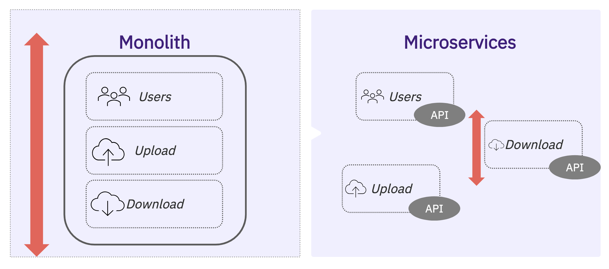
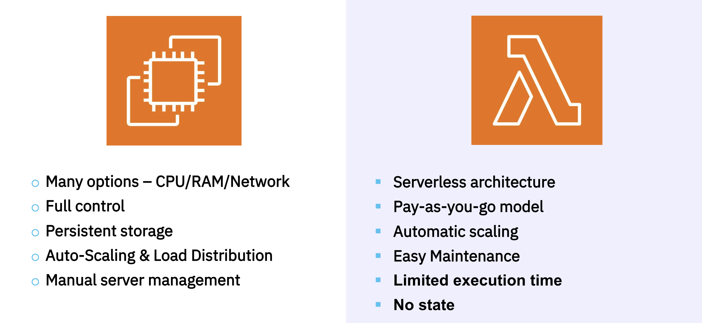
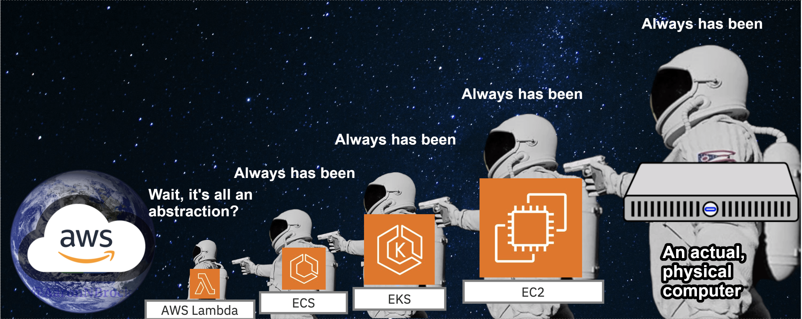

**tl;dr**: I continued preparing for the Associate DVA-C02 Exam and I presented a Lighting Talk in the office.

There still much left to learn for the certification exam. This week I learned about four AWS offerings: Route 53, VPCs, S3, and CloudFront. I also presented a Lighting Talk related to my preparation, I choose to talk about Microservices, EC2, and AWS Lambda.

---

# My takes on four AWS products

## **Route 53**

I learnt about how Domain Name Servers (DNS) work. The idea is that you are assigned an identifier or ip over a network such as 111.222.33.444. Instead of remembering the ips of every device, we store a dictionary that maps names to ips in some servers. So instead of doing a GET request to 172.217.12.110, you do it to google.com. You might have that mapping on your local cache, if not, you ask you internet providers DNS, if it doesn't know either, it tells you the ip of a DNS who might know the answer.

Route 53 is a configurable DNS provided by AWS. You define "records" that define how to route traffic given a domain.

Each record contains:

- **Domain/subdomain Name** – e.g., my-app.aws.com
- **Record Type** – (hostname to IPv4/6, hostname to hostname)
- **Value** – e.g., 12.34.56.78
- **Routing Policy** – how Route 53 responds to queries
- **TTL** – amount of time the record cached at DNS Resolvers

You can route traffict over the internet with a "Public Hosted Zone" or over private networks or Virtual Private Cloud (VPC) with a "Private Hosted Zone" that costs more.

I learnt about the concept of TTL, which means how much time should a response be cached.

I also learnt about the "Routing Policies", which are what Load Balancers internally use to distribute or route traffic to different endpoints.

Route 53 is a Domain Registar too. You can buy domain names, and use either Route 53 DNS service to manage the DNS records or a third party server. I learnt that Domain Registrar $\neq$ DNS. One is for buying names, the other is for mapping names.

## **Virtual Private Cloud (VPC)**

My weakest point in CS is network theory. I still have gaps in how does this service actually work but I learnt that VPC is a private network where services are allocated/divided to communicate.

VPCs can be partitioned into subnets, to isolate resources, combine them, etc. The idea is to have a well defined architecture to protect how services are communicating with each other.

You define bridges to communicate to the world with an Internet Gateway (IG), and for private resources you add a NAT Gateways that communicate to a IG. In these communication channels, a firewall can be added to control traffic (NACL), or via Security Groups to define rules of in/out traffic.

I learned that VPC are connected to other VPCs via "Peering". And traffic information can be captured/monitored with "Flow Logs".

Thats pretty much it. Good thing is that VPCs are covered superficially for the Associate Developer, but I will need to dig deeper if I want to get certified in other more advanced exams.

## **Amazon Simple Storage Service (S3)**

I learnt about one of the most used product AWS. That is, cloud storage.

S3 it's designed to store and retrieve any amount of data from anywhere on the web. With S3, you can create "buckets" to store your data, and each bucket can contain an unlimited number of objects.

Each object in an S3 bucket has a unique address, which is a combination of the web service endpoint, bucket name, key, and optionally, a version.

Given that you can storage any type of object, I learnt that S3 is commonly used for hosting static websites (like my blog!).

I learned about the different storage classes offered by S3, each optimized for different use cases (and cost $$$), and how to enable features like versioning control and transfer acceleration for faster and more secure file transfers over long distances.

I also learned about S3 Lifecycle Rules to move objects to the different storage classes, how you need an individual bucket for storing logs (for later analysis), and event notification to other services.

I learned some "tricks" to improve S3 performance with multi-part upload, byte-range fetches, and S3 Select.

Lastly, I learned some concepts for S3 security such at the different strategies for encryption (client-based, server-based), using pre-signed URLs to enable bucket access with expiration, and access points to manage folders withing a bucket.

## **CloudFront**

Lastly, I learnt about the concept of CDNs. Content Delivery Networks CDNs are cache servers that are closer (geographically) to the end-user, and the delivery time of the package is reduced.

Amazon CloudFront is a fast and highly secure CDN service offered by AWS with 216 Points of Presence (edge locations) globally.

CloudFront can be used with various origins, including S3 buckets, custom origins (HTTP), Application Load Balancers, and EC2 instances. It provides DDoS protection and integrates with AWS Shield and the AWS Web Application Firewall for added security.

I learned that CloudFront offers features like geo-restriction, allowing you to control access (allow/deny) content based on geographical locations. Also, CloudFront supports signed URLs and cookies to allow or restric users to access the endpoint.

I learned about CloudFront's cache policies, which allow for routing requests to different origins based on URLs or content types (text/json, etc). For example an authenticated user that wants to access to "/\*" will be redirected to "/login" that points to an EC2 application. And using a cookie, now CloudFront can return cached data.

CloudFront is a complex service that is suitable for static or almost static content, and with many users distributed globally.

# My Lighting Talk

## **AWS EC2 & Lambda: an overview of their use in Microservices**

I had the opportunity to present a Lighting Talk in the office, which allowed me to share my knowledge and practice public speaking. My talk focused on AWS EC2 and Lambda, and their use in Microservices.

I gained a better understanding of Microservices, which is an approach to structuring and developing code by separating an application into small, independent concerns or functionality known as services. These services communicate with each other through APIs, allowing for easier scaling and maintenance. This architecture fits well with the cloud model, as it enables teams to organize and solve problems at scale.

I also recapped info about EC2, which is a service that allows users to rent virtual machines (VMs) on demand. With EC2, you have full control over my virtual machines, including the operating system, CPU, RAM, and network connectivity. You can also attach databases and file systems, and scale horizontally, vertically, or distribute load. However, you are responsible for defining the policies for scaling and managing the servers.

On the other hand, I discovered that AWS Lambda is a serverless computing service that allows me to run code without provisioning or managing servers. With Lambda, I only need to provide the code that needs to be run, and AWS takes care of everything else. This means that I only pay for the compute time consumed by my code, and I don't need to worry about server management or scaling.

When deciding between EC2 and Lambda for Microservices, I learned that it ultimately comes down to cost and abstraction. If I want to abstract away server management and focus on writing code, Lambda might be the better choice. However, if I need more control over the servers and want to optimize performance at the CPU/Threads level, EC2 might be a better fit.

I also considered factors such as traffic, latency, and integration when deciding between EC2 and Lambda. For example, if I expect high and consistent traffic, reserved EC2 instances might be cheaper. On the other hand, if I'm worried about latency, I should consider Lambda's cold-start, which can cause slight delays when a function is invoked for the first time.

Overall, my Lighting Talk allowed me to share my knowledge and gain a deeper understanding of EC2, Lambda, and Microservices.

## **Deliberate practices and feedback takeaways**

The primary goal of my Lighting Talk was to enhance my communication skills and public speaking abilities. I learned about the concept of **_deliberate practice_**.

> "Using deliberate practices, in many cases, improvement isn’t about doing more things right, but about doing fewer things wrong."

I managed to give a presentation with emphasis in articulating clearly, logical flow, modulating vocal tone, spelling, grammar, punctuation, and an overall good English pronunciation. I "achieved" a strong opening, but I could have done better in providing context for the attendees. Specifically, I should have mentioned that the topic was recommended by a colleague who had experience migrating EC2 microservices to Lambdas.

One area for improvement I received as feedback was the lack of a "powerful closing". I realized that I approached this presentation as merely informative, without a central argument or main point. To address this, I plan to present a topic with less technical information and more personal opinions and insights in my next Lighting Talk.

Last takeaway is that SWE is not only about coding, but also about communicating effectively, and learning fast.
