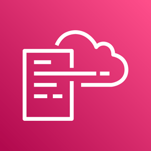

**tl;dr**: I'm almost finishing preparing for the Associate DVA-C02 Exam and I presented my second Lighting Talk (7 min).

The exam day is getting closer. This week I learned about: Containers in AWS, Elastic Beanstalk, CloudFormation, AWS Integration & Messaging, and AWS Monitoring, Troubleshooting & Audit.

---

# My takes on this week AWS offerings

## **Containers in AWS**

#### ECS, EKS, Fargate

I learned how to manage Docker containers in AWS using ECS as a container platform where containers are launched as "ECS Tasks" in a EC2 instance, that are themselseves in "ECS Clusters".

I also learned about EKS, which is Amazon's managed Kubernetes to orchestrate multiple containers.

And lastly, I learned that AWS provide a serverless platform for containers named AWS Fargate.

These offerings can be scaled in-out, up-down, with the same policies as EC2 (ECS is just an abstraction to EC2), which are: Target Tracking (some metric), Step Scaling (resource % of use), or Scheduling Scaling (date/time). And can be fronted by load balancers.

To share data between containers its recommended to mount an EFS file system onto ECS Tasks (for ECS & Fargate).

I learned about the concept of "Rolling Updates", which means that if you are launching v2 of a product (or containers in this case), you can control how many tasks can be started and stopped, and in which order. For ECS you specify a "Minimum Healthy Percent" to handle the current traffic, and a "Maximum Percent" to start migrating to v2.

I also learned about the concept of "Task Placement". When a new container is added (by scaling for example), you need to define in which EC2 instances will be placed. It can be random, or into the one with the least resources used (best effort), or evenly distributed (spread), or following some constraints such as beign in some AZ, or being a specific EC2 type class.

## **Elastic Beanstalk**

I learn about how to deploy application and provision infrastucture with no-code using Beanstalk. The idea is that if most web apps have the same architecture (Load balancers + Auto Scaling), then you can use default configurations for your infrastucture (similar to what Springboot does to Spring).

One important theme around Beanstalk is the different deployment options for updates, "Rolling Updates":

- All at once (with downtime)
- Rolling: few instances at a time
- Rolling with additional batches: rolling with a minimum healthy of 100% and a maximum percent > 100%
- Immutable: Creating a new ASG and then merging to the main ASG
- Traffic Splitting: canary testing

The deployment process is similar to a Lambda:

1. Describe dependencies (requirements.txt, package.json)

- Package code as zip
- Upload zip file
- Configurations or leave them as default
- Deploy

Under the hood Beanstalk is just using CloudFormation, which is Infrastucture as Code (IaC). Like Terraform but from Amazon.

## **CloudFormation**

Instead of creating the infrastucture (instances, roles, etc) by clicking the AWS interface or by calling the different services from the CLI. I learned that you can create all you need using a CloudFormation template using JSON or YAML.

The benefit is that no resources are manually created (reduces human error), and it can version controlled, and reviewed through code.

## **AWS Integration & Messaging**

#### SQS, SNS, Kinesis

I learned about the concept of decoupling multiple applications (or microservices) using the Async or Event Based communication pattern.

There are different important models and their respective AWS product:

- Queue model: AWS SQS, like RabbitMQ
- Pub/Sub model: AWS SNS, like Kafka, Redis
- Real-time streaming: AWS Kinesis, like Kafka again

I learned that in a Queue model you have multiple "Producers" sendind messages to a "Queue", such as events (user clicked, user left, etc), and "Consumers" "poll" that messages to process them, saved them, etc. This means that everything happenning is not synchronus, and we can decouple or services to scale depending on the load of the queue.

I learned about different strategies implemented of top of SQS such as:

- Message Visibility Timeout: Ask for more time to finish processing a message, instead of beign returned to the queue.
- FIFO Queue: Ordering of messages
- Dead Letter Queue: Messages that goes back and forth to consumers and the queue goes to a special queue for further troubleshooting
- Delay Queue: invisibility to consumers for a period of time
- Long Polling: consumers "stays" in the queue waiting until a message is received
- FIFO Deduplication: Using hashing
- FIFO Message Groping: To order in groups

Another communication model is pub/sub with AWS Simple Notification Service (SNS), to send messages to many receivers.

You have an "event producer" that sends messages to a "SNS Topic" that "publish" the messages to many "event receivers/subscribers".

I learned about the Fan Out pattern of communication using SNS + SQS, a service sends the message to many receivers but not directly, instead it publish it to queue's that other application can poll from.

Lastly, I learned about Kinesis, and the different ways to collect, process, and analyze streaming data in real-time.

Kinesis is an abstraction to SQS & SNS. In Kinesis Data Streams applications sends real-time messages (records) into a "Shard", that is, a pipeline that is connected to another application and receives the records not instantly but very close to (~200 ms)

Another offering is Kinesis Data Firehose to injest records in batches to many subscribers.

## **AWS Monitoring, Troubleshooting & Audit**

#### CloudWatch, X-Ray and CloudTrail

I learned how CloudWatch is used to a monitor and log AWS resources and applications. With CloudWatch, I can:

- Monitor performance metrics such as CPU utilization, memory usage, and disk usage
- Collect and analyze log data from AWS resources and applications
- Set alarms and notifications based on metric thresholds and log patterns
- Create dashboards to visualize performance and logs

To debug delays, or distributed tracing of messages between services I can use X-Ray:

- Trace requests as they flow through my application
- Analyze performance metrics such as latency and error rates
- Identify bottlenecks and errors in my application
- Create service maps to visualize application architecture

And lastly, to detect how my AWS organization account has been used, I need to use CloudTrail. Its a service that provides a record of all AWS API calls made within my account. It allows developers to track and monitor API calls, identify security threats, and meet compliance requirements.

# My 2nd Lighting Talk

## **How to explode your bills with AWS, and how not to**

There is a recent ["Horror Story"](https://medium.com/@maciej.pocwierz/how-an-empty-s3-bucket-can-make-your-aws-bill-explode-934a383cb8b1) about a software developer who was billed $1,300 for an empty S3 bucket. It turned out that a popular open-source library had a default configuration that pointed to the developer's bucket, resulting in nearly 100 million S3 PUT requests in just one day. AWS waived the bill, but it gained popularity until AWS decided to path this design.

**Strategies for Mitigating Risks**

To avoid similar horror stories, I learned about several strategies to mitigate an exploding bill:

1. **_Principle of Least Privilege:_** Ensure that users and services only have access to specific resources they need to perform their tasks.
2. **_Communication:_** Communicate early and often, especially when unsure about what you're doing, to ensure that more experienced team members can identify potential problems before they escalate.
3. **_Monitoring:_** Monitor AWS resources and costs to detect unusual activity or unexpected cost spikes.
4. **_Response Plan:_** Have a plan in place to respond to unexpected cost spikes, such as setting CloudWatch alarms or limiting services.

**Takeaway**

As developers, we need to be proactive in managing AWS costs and understanding how the pricing works. It's not just about building cool applications; it's also about being responsible with our clients' resources.

## **Deliberate practices and feedback takeaways**

This topic was better than the last one. I learned how to do a better introduction and conclusion, and keep the audience interested with the content.

Overall, my second Lighting Talk allowed me to gain a deeper understanding of AWS pricing, and how to keep ourselves protected.

#zero-spend-budget-4life
