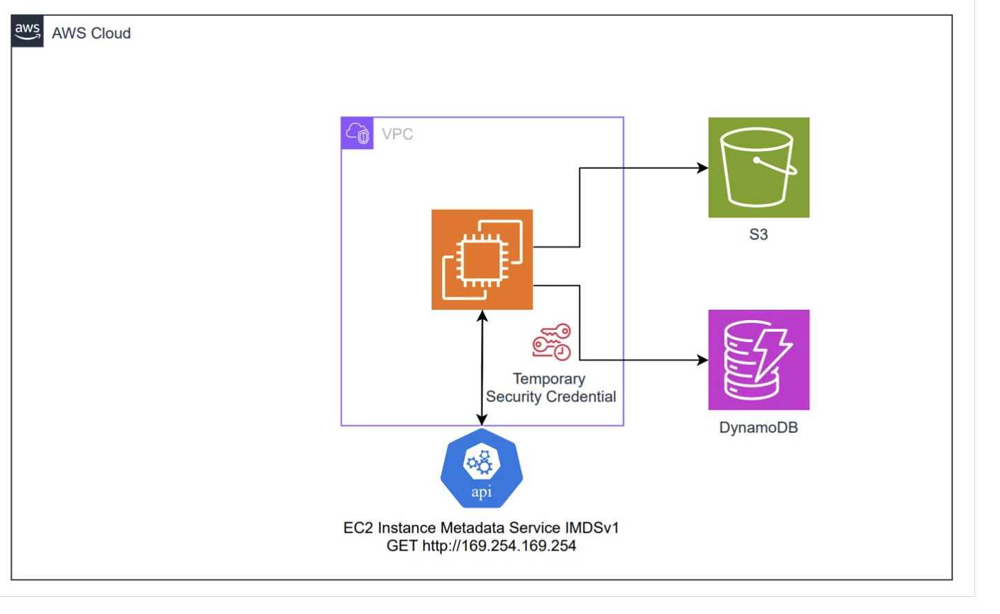
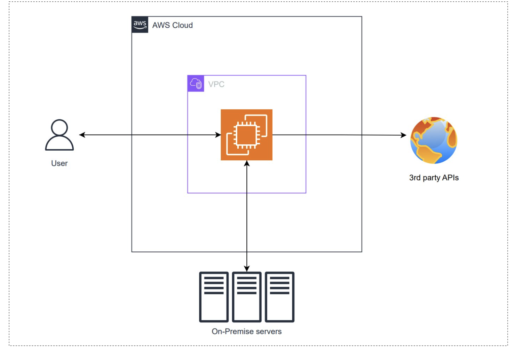
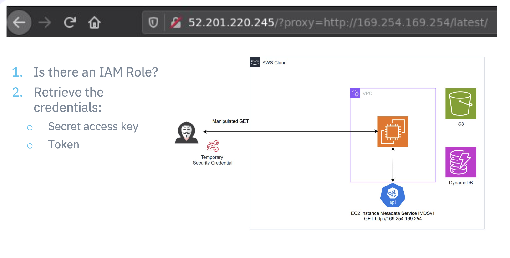
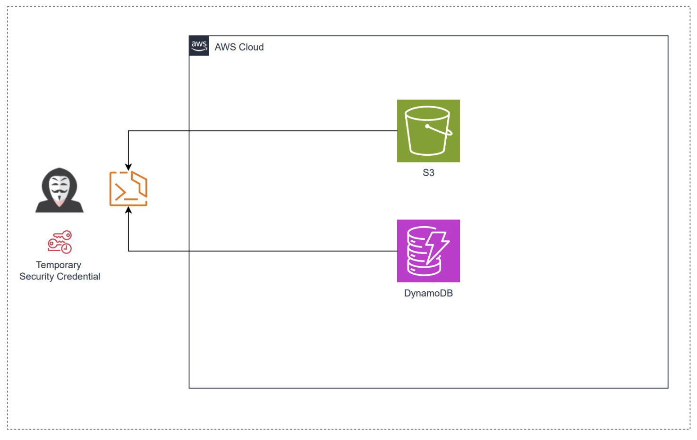
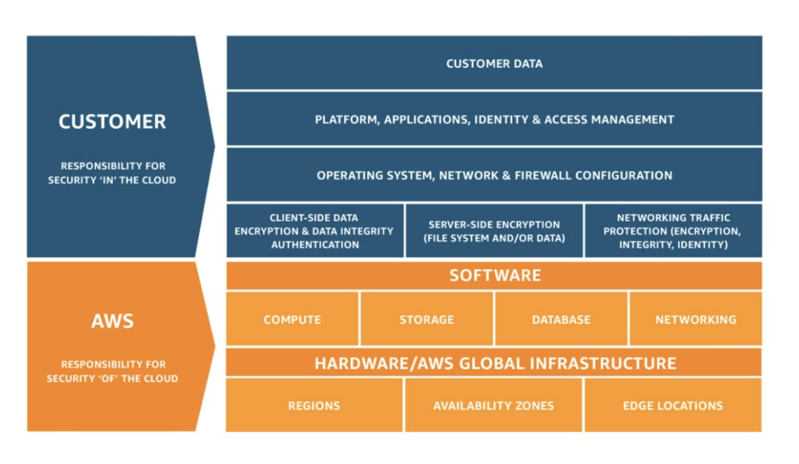

**tl;dr**: Finally completed the Udemy course on AWS that I've using for the last 4 weeks, and gave my last presentation in the format of an Ignite Talk.

This last iteration of the course was really packed with information. I learned about Lambda, DynamoDB, API Gateway, AWS CI/CD, SAM, CDK, Cognito, Step Functions, AppSync, AWS Security & Encryption, and some filler AWS services.
I won't get in detail about all of them in this post, I DID learnt a lot, and I will take me valuable time that I could use to brush up some concepts for the exam.

I also gave my final presentation, an Ignite Talk (5 min), about a vulnerability on EC2 Metadata services using Server-Side Request Forgery (SSRF).

---

# My takes on this week AWS offerings, from a tl;dr perspective

## **Lambda**

Lambda is a serverless computing service offered by AWS, which means I don't need to worry about provisioning or managing servers. I can simply write my code, zip it, and deploy it to Lambda, and it will take care of the rest.

I can run my code in response to events, such as changes to an Amazon S3 bucket or an Amazon DynamoDB table. This is called an "event-driven" architecture, and it's really powerful because it allows me to visualize better the data flow from certain applications, and have pit stops for processing the data before sending it to another place.

I talked more about this service, and its use with microservices in my first [Lighting Talk](https://enrique-giottonini.github.io/post/spark-week-7/)

## **DynamoDB**

I learned about AWS DynamoDB, a fully managed NoSQL database service offered by AWS. The idea of NoSQL is that the "not-structured" data allows for a service that can scale horizontally, that is, instead of increasing the resource for a single service, it spawns more copies of the same to handle the queries. That means that I can build applications that can handle a large number of users and requests without worrying about the database becoming a bottleneck.

I learned that it's a key-value and document database, which means I can store and retrieve data using a unique key or by querying the data using a document-based query language (even SQL-like).

## **API Gateway**

I learned about AWS API Gateway, a service that allows me to create RESTful APIs that can be accessed from anywhere, that means that I can define APIs that can be used to expose my application's functionality to clients, such as web and mobile applications. I can define API endpoints, methods, and parameters, and API Gateway takes care of the rest, including authentication, rate limiting, and caching.

The real useful aspect of this service is its integration with other AWS services, such as Lambda and DynamoDB. This means I can create APIs that can trigger Lambda functions or interact with DynamoDB tables, making it easy to connect services.

## **AWS CI/CD**

I learned about AWS CI/CD, a set of services that enables me to automate my application's build, test, and deployment process. In simple terms:

- AWS CodeCommit = GitHub
- AWS CodeBuild = Jenkins for build and test stage
- AWS CodeDeploy = Jenkins for deploying

## **Serverless Application Development (SAM)**

An abstraction of CloudFormation (IaC) but for serverless services. With SAM, I can define my architecture using a simple YAML file, and then use the SAM CLI to build, deploy, and manage my application.

## **Cloud Development Kit (CDK)**

A library in Java, Python, etc that compiles to CloudFormation, that means I can define the infrastructure using a language I already know instead of learning `!Ref` or `!Fn` or other nuances of CloudFormation.

## **Cognito**

I learned about AWS Cognito, a service where I can create user pools and identity pools, which enable me to manage user identities and access control for my applications. I can also use Cognito to authenticate users using social media, OpenID Connect, and SAML, making it easy to integrate with existing identity systems.

## **Step Functions**

Low-code and visual state machines to design workflows with AWS services.

## **AppSync**

Like an API Gateway but using GraphQL and the pub/sub model.

## **AWS Security & Encryption**

I can use services such as IAM, KMS, and CloudWatch to secure my AWS resources and protect my data. I can also use AWS security features, such as encryption at rest and in transit, to ensure that my data is protected from unauthorized access.

The idea is that to encrypt and decrypt data you need to define a function (or key) that is computationally expensive to decrypt by your own. If you need your data to be encrypted (for compliance reasons), KMS can create and store securily this keys for you, change them from time to time (rotation), and integrates well with other services such as S3, DynamoDB, Parameters Store, etc.

I learned how TSL ecryption in flight works, and filling some holes in my knowledge of networks, which in retrospective is very interesting, and I plan to start digging into a book for more.

# Final Ignite Talk

## **Stealing IAM Roles: The Dangers of Server-Side Request Forgery Attacks in AWS EC2**

I gave this talk because security is a broad area, there are many unknowns unknowns if you are not security expert, and I wanted to show that attacks can be very simple, and yet affect even large companies with thousands of engineers. In this short talk I presented very simple exploit that could get your AWS credentials stolen, and open the door to your cloud infrastructure.

This specific attack exploits the design of EC2 Instance Metadata Service version one, that is, from all your applications running on instances created before 2019 and not yet updated.

EC2 allows you to rent virtual machines to deploy your applications, your frontend, your backend, and from within your instance you can make GET request to the meta data service of your application to retrieve your region, your availability zone, but most important, to retrieve the IAM service roles that your instance has, that define what other services it can access, either your data in S3 buckets, or your DynamoDB tables, etc, by providing your instance with temporary credentials, or tokens.

Pretty useful design, but, it does open some vulnerabilities. The prerequisites for the attack is that you allow a web server in your instance to make GET request, or proxy them, but you are not whitelisting the request targets. You may need it to connect to your on-premise servers, or make some calls to a third party API:

But if your are not careful you might also allow to access your internal services, which is what server-side request forgery is about, when an attacker abuse functionality on the server to read or update internal resources,
in this case the metadata service don't trust the user, but trusts your server for the information. If an attacker discover this vulnerability, it will use the metadata service to check if there is IAM role associated to your instance, get the name, and retrieve the credentials that have a secret access key, and a token to access your data if your service roles are not restrictive.

It's a very simple attack, you only need two points of failure, a web server that proxy requests and is too permissive, and permissive roles to your instance. No one is actually going to miss that right?

[**Capital One's $190M Cloud Data Breach**](https://www.capitalone.com/digital/facts2019/)

In 2019 an American bank was attacked with this strategy, escalated its permissions, and gained access to a lot of data about personal information, credit card numbers, social security numbers, transactions, and insurances, affecting a hundred and six millions clients, and costing over a hundred and ninety millions on settlements.

**Takeaway**

We all are exposed to attacks, they can be pretty simple ones, we might overlook vulnerabilities, and they cost. What we can do is follow best practices, stay updated, and remember that there is shared responsibility model between AWS and you.

## **Deliberate practices and feedback takeaways**

This topic was interesting to prepare and present, and the audience liked it. I felt more confidence in my delivery, and answering questions. Kudos to my mentor Judith Garcia for her advices in how to prepare presentations to keep the audience engaged, I followed her recommendations for my last two presentations and they were much better. I also thank the staff and other mentors for allowing this space to present and receive feedback, I feel more prepared for speaking in public.
